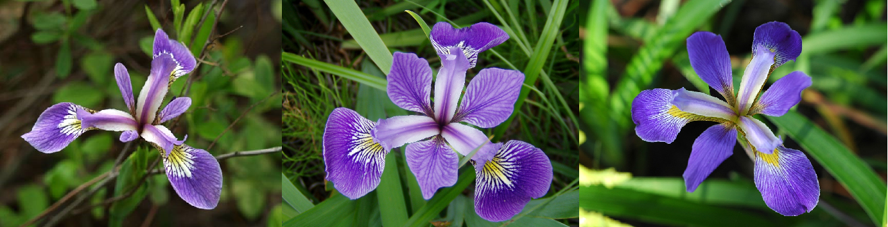
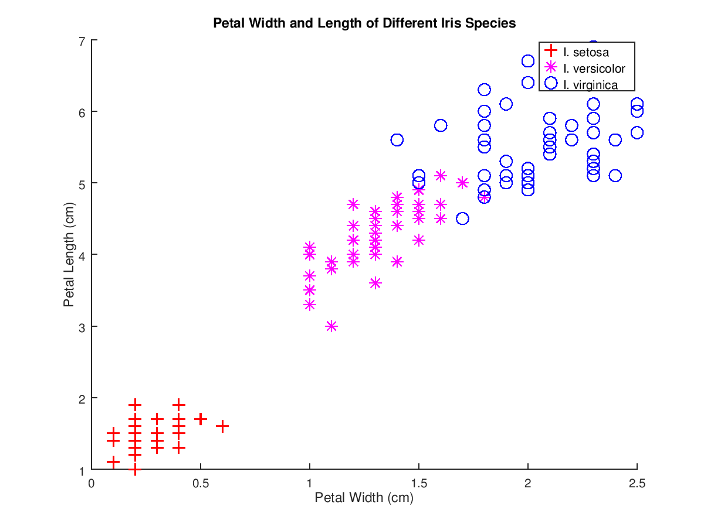
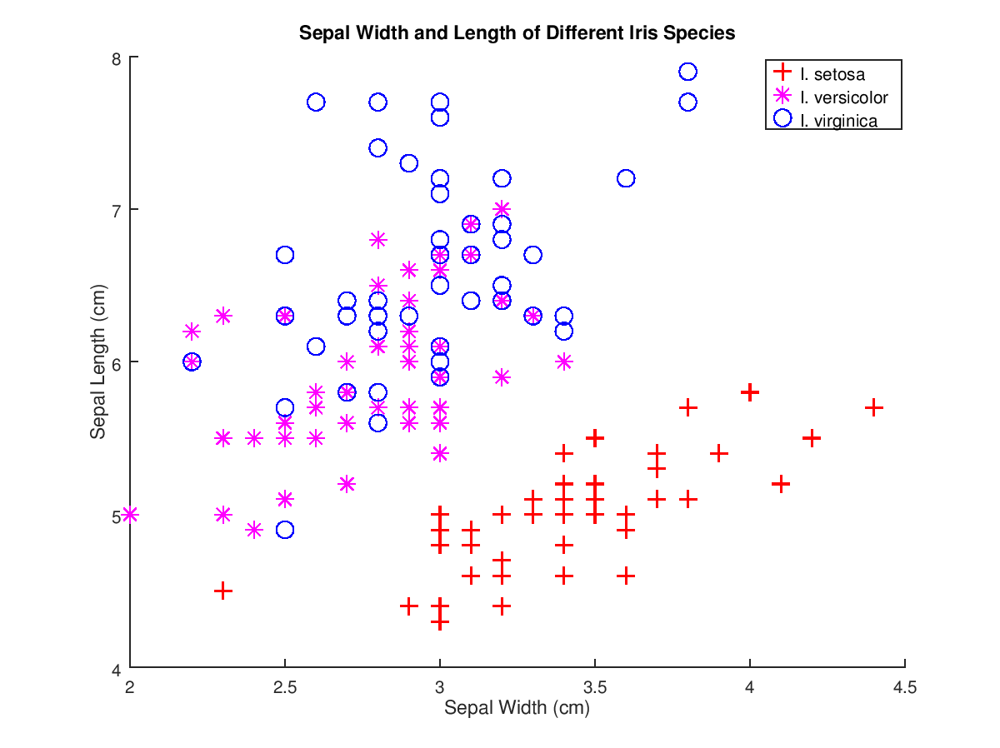

# Predict-Iris

Predict three different Iris species according to its petal and sepal width and length using Octave and Machine learning:

  

* Iris setosa
* Iris versicolor
* Iris virginica

## How to run

In Octave CLI, you must be in the src directory then type:

	run predictIris.m

## Charts

  
  

